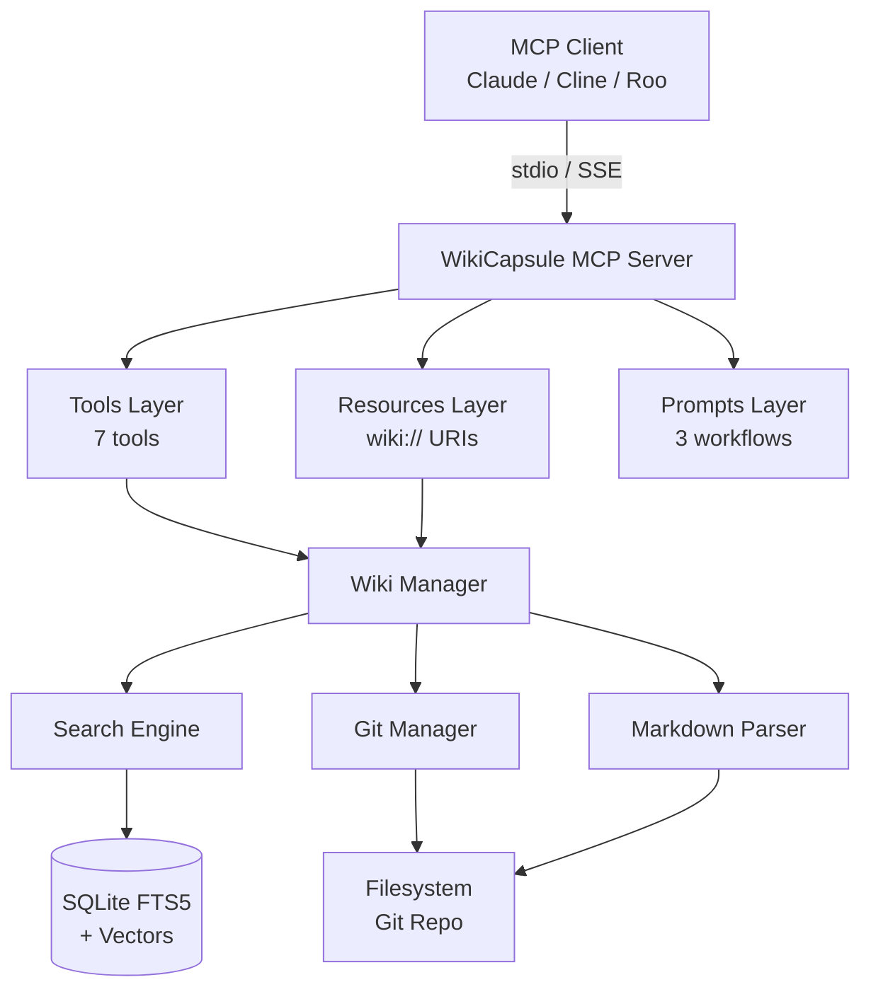
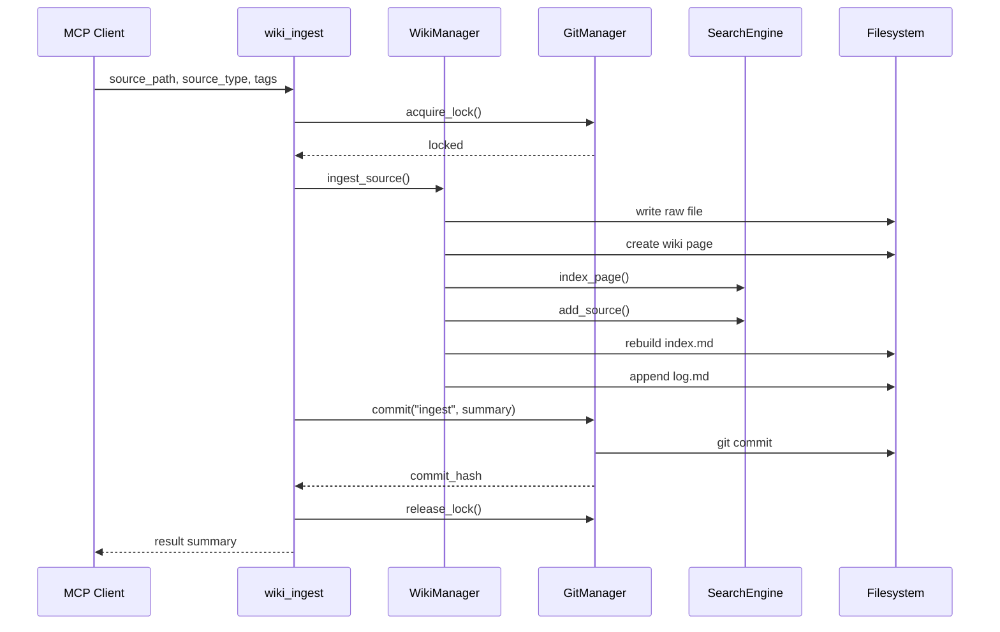
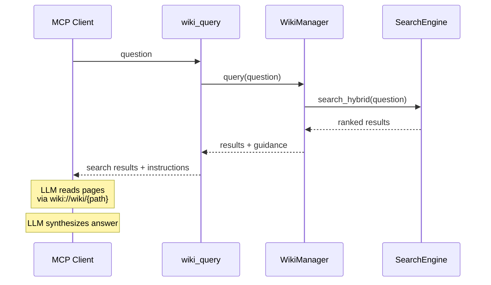

# Architecture

Detailed architecture with component diagrams.

## System Overview



## Component Architecture

### MCP Server Layer (`server.py`)

Entry point. Creates a `FastMCP` instance and registers:
- 4 resource handlers (index, log, WIKI.md, dynamic wiki/raw)
- 7 tool functions via `register_tools()`
- 3 prompt functions

Transport mode (stdio/SSE) is determined at startup and passed to `mcp.run()`.

### Tools Layer (`tools.py`)

All 7 MCP tools are defined here. Each tool:
1. Validates input using Pydantic models
2. Acquires git lock via `GitManager` context manager
3. Calls `WikiManager` for the actual operation
4. Commits changes via `git.commit()`
5. Returns markdown-formatted results

Tools never call LLM APIs. They're pure data operations.

### Resources Layer (`resources.py`)

Resource handlers resolve `wiki://` URIs to actual file content. Three categories:
- **Core**: `wiki://index.md`, `wiki://log.md`, `wiki://WIKI.md`
- **Wiki pages**: `wiki://wiki/{path}` → `wiki/{path}`
- **Raw documents**: `wiki://raw/{path}` → `raw/{path}`

Resources are read-only. The LLM reads them for context.

### Wiki Manager (`wiki.py`)

Central orchestrator. Manages:
- **Directory structure**: Creates/verifies wiki layout
- **Page CRUD**: create_page, update_page, get_page
- **Ingest workflow**: Source → raw file + wiki page + index update + log entry
- **Index maintenance**: Rebuilds index.md from current pages
- **Log maintenance**: Appends to log.md
- **Lint**: Orphan detection, broken links, empty pages, draft rot
- **Stats**: Aggregated metrics across all pages

Uses `GitManager` for locking/commits and `SearchEngine` for indexing.

### Search Engine (`search.py`)

Hybrid search using two complementary approaches:

**BM25 (FTS5)**:
- SQLite virtual table `pages_fts`
- Triggers keep FTS index synced with `pages` table
- Excellent for keyword matching, exact phrases

**Vector Search**:
- `all-MiniLM-L6-v2` model (384-dim, local)
- Embeddings stored as BLOBs in `page_embeddings` table
- Cosine similarity for ranking
- Excellent for semantic/conceptual matching

**RRF Fusion**:
```
score = (1 - alpha) * BM25_RRF + alpha * Vector_RRF
where RRF(rank) = 1 / (k + rank), k = 60
```

Alpha is configurable (default 0.5 = equal weighting).

### Git Manager (`git_manager.py`)

Wraps `gitpython` with concurrency control:
- **Lock file**: `.wikicapsule/lock.json` with PID and timestamp
- **Timeout**: 30 seconds (configurable) before considering lock stale
- **Dirty detection**: Warns if working tree has uncommitted changes
- **Auto-commit**: Every modification triggers descriptive commit
- **Atomic operations**: Lock → check → modify → commit → release

### Markdown Parser (`markdown.py`)

Handles wiki page format:
- **Frontmatter**: YAML block with title, type, tags, sources, status
- **Wikilinks**: `[[Page Name]]` extraction and resolution
- **Content**: Body text, preview generation
- **Rendering**: Page → markdown string with frontmatter

## Data Flow Diagrams

### Ingest Flow



### Query Flow



## Directory Layout

```
wiki/
├── raw/               # Immutable source documents
│   ├── articles/      # Blog posts, news
│   ├── papers/        # Academic papers
│   ├── books/         # Book chapters
│   ├── transcripts/   # Meeting transcripts
│   └── assets/        # Images, attachments
├── wiki/              # Generated markdown pages
│   ├── index.md       # Auto-maintained catalog
│   ├── log.md         # Auto-maintained log
│   ├── overview.md    # High-level synthesis
│   ├── entities/      # People, organizations
│   ├── concepts/      # Ideas, theories
│   ├── sources/       # One page per source
│   ├── comparisons/   # Decision matrices
│   └── explorations/  # Query answers
├── .wikicapsule/
│   ├── search.db      # SQLite search index
│   ├── config.yaml    # Configuration
│   └── lock.json      # Process lock
├── WIKI.md            # Schema documentation
└── .git/              # Version control
```

## Concurrency Model

Single-writer, multi-reader:
- File lock ensures only one process modifies the wiki
- Search reads don't require locking
- Resource reads don't require locking
- Lock timeout prevents deadlocks from crashed processes

## Scalability Considerations

| Aspect | Current | Limit |
|--------|---------|-------|
| Pages | SQLite handles this fine | 100K+ pages |
| Search latency | ~50ms for 100 pages | Budget: 500ms |
| Ingest time | ~1s per source | Budget: 5s |
| Vector model | all-MiniLM-L6-v2 (384d) | Swap for larger |
| Git repo | Linear with commits | No hard limit |

For very large wikis (10K+ pages):
- Consider dedicated vector DB (Qdrant, Milvus)
- Use larger embedding model (all-mpnet-base-v2)
- Enable SQLite WAL mode for better concurrency
